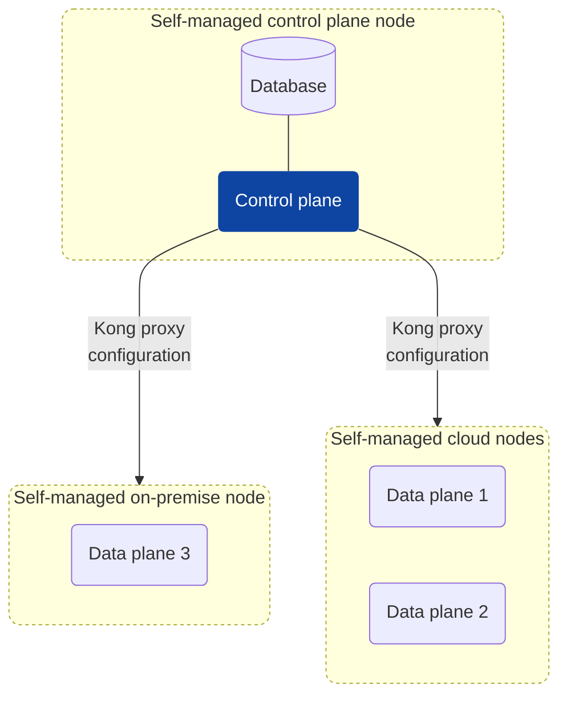

# 3. Kong Enterprise CP/DP (Hybrid Mode) Deployment Architecture

Date: 2025-04-21

## Tags

hybrid-mode, control-plane, data-plane, deployment, architecture, enterprise

## Status

Accepted

Implements recommended architecture from [2. Recommended Kong Deployment Architectures](0002-recommended-kong-deployment-architectures.md)

## Context

Customers require full control over the infrastructure and configuration of Kong Gateway to meet compliance, security, and operational requirements.  
This model suits organizations running on-premises or private cloud environments.

## Decision

Deploy Kong Gateway using a customer-managed Control Plane (CP) and one or more customer-managed Data Planes (DP) in a Hybrid Mode architecture.

## Architecture

- **Control Plane (CP)**: Handles configuration; no runtime traffic.
- **Data Plane (DP)**: Handles runtime API traffic; read-only config sync from CP.
- **Communication**: Secure mTLS connection between CP and DPs.

## Use Cases

- Full control over infrastructure (on-premises, private cloud).
- Regulatory compliance (finance, healthcare, government).
- Highly customized networking, logging, and monitoring setups.

## Consequences

### Positive Outcomes

- Total ownership of Kong Gateway configuration and data.
- Flexible scaling of CP and DPs independently.
- Leverage full suite of Kong Enterprise features.

### Risks

- Customers are responsible for database high availability (PostgreSQL).
- Upgrades, patches, scaling, and monitoring are customer responsibilities.
- Developer Portal is not available in a self-managed Hybrid deployment.
- Built-in analytics functionality is not available.
- Service Catalog integration is not available.

## References

- [Self](https://github.com/KongHQ-CX/architecture-decision-records/blob/main/doc/adr/0003-kong-enterprise-hybrid-deployment.md)
- [Hybrid Mode Overview](https://docs.konghq.com/gateway/latest/production/deployment-topologies/hybrid-mode/)
- [Hybrid Mode Setup Guide](https://docs.konghq.com/gateway/latest/production/deployment-topologies/hybrid-mode/setup/)
- [Control Plane and Data Plane Configuration](https://docs.konghq.com/gateway/latest/production/deployment-topologies/hybrid-mode/cp-dp-config/)

## Diagram

