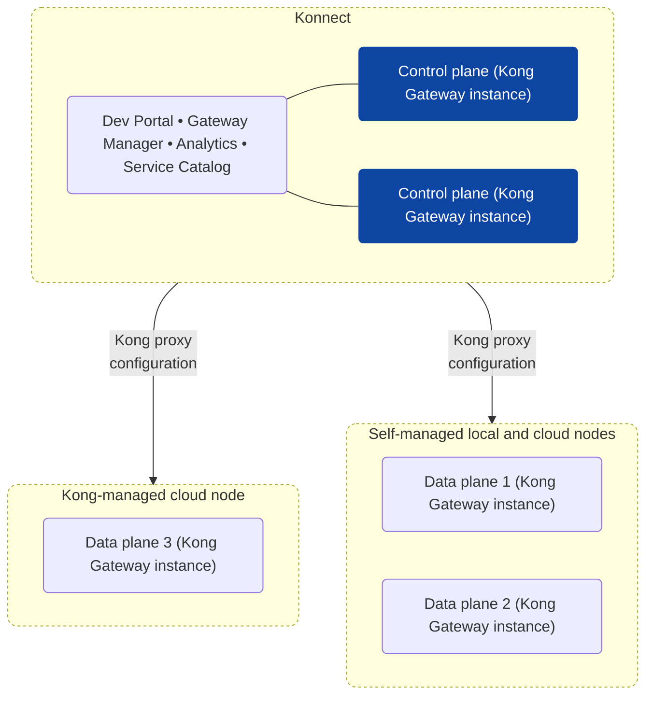

# 4. Kong Konnect (SaaS Control Plane) Deployment Architecture

Date: 2025-04-21

## Tags

konnect, saas, control-plane, cloud, deployment, architecture, dedicated-cloud-gateways

## Status

Accepted

Implements recommended architecture from [2. Recommended Kong Deployment Architectures](0002-recommended-kong-deployment-architectures.md)
Alternative: [168. Deploying Kong Gateway Enterprise Data Planes on AWS ECS Fargate](0168-deploying-kong-gateway-enterprise-data-planes-on-aws-ecs-fargate.md)

## Context

Customers aiming to minimize operational burden and accelerate deployment timelines prefer leveraging Kong's fully managed Control Plane (Konnect SaaS).

## Decision

Use Kong Konnect as the managed Control Plane with Data Planes deployed in the customer's environment or as Kong-managed Dedicated Cloud Gateways.

## Architecture

- **Control Plane (Konnect)**: Hosted by Kong as a SaaS offering.
- **Data Planes**: Either customer-managed or Kong-managed (Dedicated Cloud Gateways).
- **Communication**: Secure mTLS-based control plane to data plane sync.

## Use Cases

- Multi-cloud or hybrid-cloud API management.
- Organizations needing centralized governance with minimal operations overhead.
- Customers seeking built-in analytics, portal, and developer onboarding features.

## Consequences

### Positive Outcomes

- Rapid deployment with minimal infrastructure management.
- Automatic upgrades, security patching, and scaling for the Control Plane.
- Centralized telemetry, service catalog, and developer portal.

### Risks

- Requires outbound internet access for Control Plane communication.
- Slightly less flexibility for deep platform customizations.

## References

- [Self](https://github.com/KongHQ-CX/architecture-decision-records/blob/main/doc/adr/0004-kong-konnect-saas-deployment.md)
- [Kong Konnect Overview](https://docs.konghq.com/konnect/overview/)
- [Konnect Runtime Manager](https://docs.konghq.com/konnect/runtime-manager/)
- [Setting up a Data Plane Node in Konnect](https://docs.konghq.com/konnect/runtime-manager/runtime-groups/data-plane-nodes/)

## Diagram

