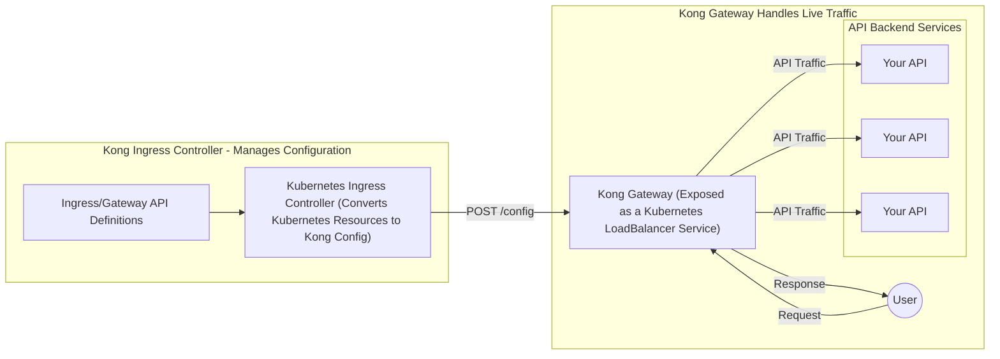

# 5. Kong Ingress Controller Kubernetes-native Deployment Architecture

Date: 2025-04-21

## Tags

kubernetes, ingress-controller, k8s, deployment, architecture, kic, gateway-api, microservices, gitops

## Status

Accepted

Implements recommended architecture from [2. Recommended Kong Deployment Architectures](0002-recommended-kong-deployment-architectures.md)

## Context

Organizations embracing Kubernetes need a native API Gateway and Ingress Controller that integrates seamlessly with their Kubernetes ecosystem.

## Decision

Deploy Kong Ingress Controller (KIC) within Kubernetes clusters to manage ingress and API traffic.

### Architecture

- **Ingress Controller**: Runs as a Kubernetes controller managing Kong Gateway data planes.
- **Configuration**: Kubernetes-native resources (Ingress, Gateway API, custom CRDs).
- **Optional**: Connect to Kong Konnect for centralized configuration and analytics.

### Use Cases

- Kubernetes-native applications.
- Internal and external API exposure in microservices architectures.
- GitOps-driven configuration of API gateways.

## Consequences

### Positive Outcomes

- Declarative API configuration through Kubernetes manifests.
- Horizontal scalability leveraging Kubernetes features.
- Seamless integration with Kubernetes RBAC and observability tooling.

### Risks

- Without Konnect integration, control plane functionality is limited to Kubernetes cluster boundaries.
- Complex multi-cluster deployments may require additional tools or integrations.

## References

- [Self](https://github.com/KongHQ-CX/architecture-decision-records/blob/main/doc/adr/0005-kong-ingress-controller-kubernetes-deployment.md)
- [Kong Ingress Controller Documentation](https://docs.konghq.com/kubernetes-ingress-controller/latest/)
- [Installation Guide](https://docs.konghq.com/kubernetes-ingress-controller/latest/installation/)
- [Kong Gateway on Kubernetes](https://docs.konghq.com/gateway/latest/install/kubernetes/)

## Diagram

