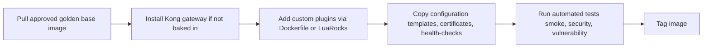

# 7. Kong Image Build Process

Date: 2025-04-22

## Tags

image, build, ci-cd, docker, plugins, deployment, containerization, kong-gateway, artifact-management, versioning, golden-image, pipeline, automation, testing

## Status

Accepted

Uses [6. Golden‑Image Standardization](0006-golden-image-standardization.md)

Uses [8. Custom‑Plugin Deployment Strategy](0008-custom-plugin-deployment-strategy.md)

## Context

Once a golden base image exists, teams need a reliable process to produce the “final” Kong image—including plugins, configuration snippets, and operational agents—via CI/CD.

## Decision

Define a CI/CD‑driven Docker build pipeline that:

1. **Pulls** the approved golden base image.
2. **Installs** Kong (if not already baked in).
3. **Adds** custom plugins via Dockerfile or LuaRocks (see ADR‑0008).
4. **Copies** configuration templates, certificates, and health‑checks into the image.
5. **Runs** automated tests (smoke, security scan, vulnerability scan).
6. **Tags** the image with three components: `<golden‑image-version>-<kong-version>-<plugin‑bundle-version>`.

All builds must run in an ephemeral CI agent; no manual “docker build” steps are permitted outside of this pipeline.

## Consequences

### Positive Outcomes

- Fully automated, auditable image builds.
- Traceable artifact versions matching Git tags.
- Early failure detection via CI tests.

### Risks

- CI pipeline complexity needs maintenance.
- Build times may increase as tests and packaging steps grow.

## References

- [Self](https://github.com/KongHQ-CX/architecture-decision-records/blob/main/doc/adr/0007-kong-image-build-process.md)
- [Kong Docker Installation](https://docs.konghq.com/gateway/latest/install/docker/)
- [Kong Container Image Reference](https://docs.konghq.com/gateway/latest/reference/configuration/)

## Diagram

