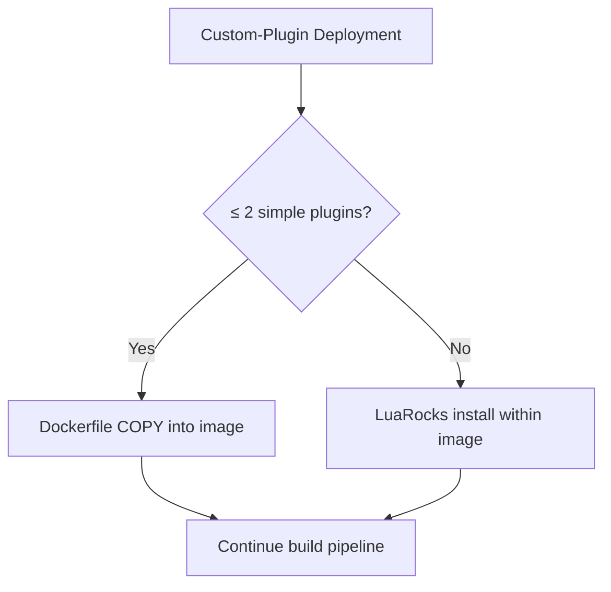

# 8. Custom‑Plugin Deployment Strategy

Date: 2025-04-22

## Tags

plugins, deployment, lua, custom-plugins, luarocks, kong-gateway, plugin-management, dependency-management, immutable-infrastructure, packaging, build-process, containerization

## Status

Accepted

Used by [7. Kong Image Build Process](0007-kong-image-build-process.md)

Requires [9. Plugin Versioning & Naming Scheme](0009-plugin-versioning-naming-scheme.md)

Uses [10. LuaRocks Package‑Management for Kong Plugins](0010-luarocks-package-management.md)

## Context

Kong custom plugins (Lua-based) must be delivered into the Gateway container. There are three options:

1. Dockerfile / script copy
2. Mount or ConfigMap
3. LuaRocks package manager

We need a clear, scalable strategy.

## Decision

1. **For up to two simple plugins** (no external dependencies), use a **Dockerfile COPY** step (or scripted install) into `/usr/local/share/lua/…`.
2. **For three or more plugins, or any with dependencies**, use **LuaRocks** inside the image:
   - Declare plugins as rockspec dependencies.
   - Run `luarocks install` during build.
3. **Avoid** ConfigMap/mount approaches entirely, preserving image immutability.

## Consequences

### Positive Outcomes

- Simple path for small teams/plugins.
- Scalable, dependency‑safe installs via LuaRocks for larger fleets.
- Immutable images remain guaranteed identical across runs.

### Risks

- Dockerfile copy can become error-prone if over‑used.
- LuaRocks adds build‑time complexity and needs proper rockspec management.

## References

- [Self](https://github.com/KongHQ-CX/architecture-decision-records/blob/main/doc/adr/0008-custom-plugin-deployment-strategy.md)
- [Plugin Development Guide](https://docs.konghq.com/gateway/latest/plugin-development/)
- [Managing Plugins](https://docs.konghq.com/gateway/latest/admin-api/plugins/)

## Diagram

