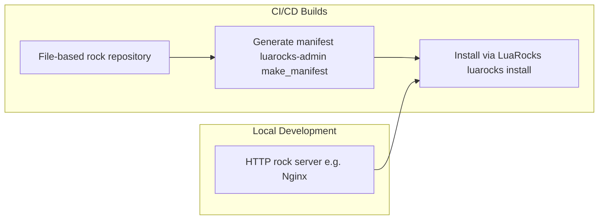

# 11. LuaRocks Server Hosting Strategy

Date: 2025-04-22

## Tags

kong, gateway, plugin, luarocks, package-repository, dependency-management, artifact-hosting, build-process, plugin-distribution, security, ci-cd, local-development

## Status

Accepted

Used by [10. LuaRocks Package‑Management for Kong Plugins](0010-luarocks-package-management.md)

## Context

Private LuaRocks servers prevent dependency hijacking and ensure curated plugin availability. Two main hosting modes exist:

- File‑based manifest served from local FS.
- HTTP‑based server (e.g. Nginx).

## Decision

1. **CI/CD builds** will use a **file‑based** rock repository: copy the `/petrocks` directory into the build agent and run `luarocks-admin make_manifest` at build time.
2. **Local development** can optionally spin up a **lightweight HTTP server** (Nginx) to avoid FS mounts.
3. **Do not** rely on public rock repositories for custom plugins.

## Consequences

### Positive Outcomes

- Full control over allowed plugin versions.
- CI‑embedded manifest guarantees reproducible installs.
- Local dev flexibility via HTTP if needed.

### Risks

- Must maintain two workflows (file vs HTTP).
- Manifest generation must be automated to avoid staleness.

## References

- [Self](https://github.com/KongHQ-CX/architecture-decision-records/blob/main/doc/adr/0011-luarocks-server-hosting-strategy.md)
- [Custom Plugins in Kong](https://docs.konghq.com/gateway/latest/plugin-development/distribution/)
- [Installing a Custom Plugin](https://docs.konghq.com/gateway/latest/plugin-development/distribution/)

## Diagram

