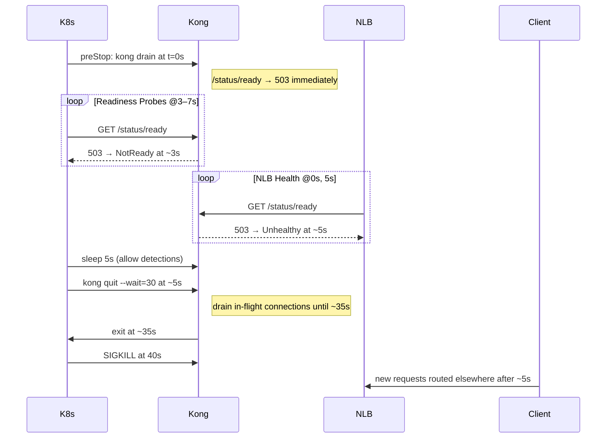

# 200. Ensure Zero Downtime by Kong Gateway on AWS EKS with NLB

Date: 2025-06-16

## Tags

kubernetes, eks, nlb, zero-downtime, lifecycle, probes, kong-3.10, graceful-shutdown

## Status

Accepted

## Context

When running Kong Gateway on Amazon EKS behind an AWS Network Load Balancer (NLB), rolling updates can briefly disrupt in-flight requests unless the old pod is drained gracefully. The `kong drain` command flips readiness immediately, and the `kong quit` command gracefully shuts down in-flight connections. We need a standardized, predictable procedure to:

* Immediately remove a terminating pod from service.
* Drain existing connections without forcing errors.
* Ensure Kubernetes and NLB health checks detect the pod as unhealthy within defined windows.
* Complete shutdown within Kubernetes’ `terminationGracePeriodSeconds`.

## Decision

We will adopt a standardized pod termination lifecycle that leverages Kubernetes’ PreStop hook, tuned readiness and liveness probes, and specific AWS NLB annotations. The steps are:

1. **PreStop Hook & Pod Lifecycle**

   Configure each Kong Gateway pod with:

   ```yaml
   spec:
     terminationGracePeriodSeconds: 40  # 5s readiness flip + 30s graceful quit + 5s buffer
     containers:
     - name: proxy
       image: kong:3.10
       lifecycle:
         preStop:
           exec:
             command:
               - sh
               - -c
               - |
                 # 1) Flip readiness immediately
                 kong drain
                 # 2) Wait for K8s & NLB to detect 503s
                 sleep 5
                 # 3) Begin graceful quit (in-flight drain up to 30s)
                 kong quit --wait=30
   ```

   * `kong drain` makes `/status/ready` return 503 immediately.
   * `sleep 5` allows readiness probes and NLB health checks to observe failures.
   * `kong quit --wait=30` stops accepting new connections and drains existing ones for up to 30 s.

2. **Readiness & Liveness Probes**

   **Readiness Probe**:

   ```yaml
   readinessProbe:
     httpGet:
       path: /status/ready
       port: status
       scheme: HTTP
     initialDelaySeconds: 3
     periodSeconds: 2
     timeoutSeconds: 5
     failureThreshold: 3
     successThreshold: 1
   ```

   * Fails at t = 3 s, 5 s, 7 s → NotReady by \~7 s after start of checks.
   * If `kong drain` at t = 0, first failing probe at t = 3 s.

   **Liveness Probe**:

   ```yaml
   livenessProbe:
     httpGet:
       path: /status
       port: status
     initialDelaySeconds: 20
     periodSeconds: 10
     timeoutSeconds: 5
     failureThreshold: 3
   ```

   * Detects hung Kong processes and triggers restarts after \~30 s of consecutive failures.

3. **AWS NLB Health Check & Target Group**

   Annotate the Service:

   ```yaml
   annotations:
     service.beta.kubernetes.io/aws-load-balancer-healthcheck-protocol: "HTTP"
     service.beta.kubernetes.io/aws-load-balancer-healthcheck-port:       "8100"
     service.beta.kubernetes.io/aws-load-balancer-healthcheck-path:       /status/ready
     service.beta.kubernetes.io/aws-load-balancer-healthcheck-interval:   "5"
     service.beta.kubernetes.io/aws-load-balancer-healthcheck-timeout:    "2"
     service.beta.kubernetes.io/aws-load-balancer-healthcheck-unhealthy-threshold: "2"
     service.beta.kubernetes.io/aws-load-balancer-target-group-attributes: |
       deregistration_delay.timeout_seconds=60,connection_termination.enabled=true
   ```

   * Health checks at 0 s, 5 s; two consecutive failures → Unhealthy by \~5 s.
   * Deregistration delay of 60 s allows in-flight requests from NLB to finish.

> **Tip:** Use a dedicated status port/path for health checks (`/status/ready`) to isolate from application logic flakiness.

4. **Sequence Diagram**



## Consequences

### Positive Outcomes

* **Zero-Downtime Deployments**: Existing requests are drained gracefully; new clients see no errors.
* **Predictable Cutovers**: Timing windows (5 s readiness, 30 s drain) are well-defined and repeatable.
* **Clear Observability**: Probes and NLB statuses clearly reflect pod readiness and health.
* **Kubernetes-Native**: Leverages built-in hooks and probe mechanisms without external controllers.

### Risks

* **Timing Misconfiguration**: If `terminationGracePeriodSeconds` < (sleep + wait + buffer), pods may be killed before drains complete.
* **Complexity**: Multiple tuned parameters (probes, sleep, deregistration delays) increase cognitive overhead.
* **Resource Pressure**: During rolling updates, old pods linger up to 40 s after shutdown begins, requiring capacity planning.
* **Dependency on Kong 3.10**: Older versions lack `kong drain`; must upgrade all clusters.

## References

* [Self](https://github.com/KongHQ-CX/architecture-decision-records/blob/main/doc/adr/0200-ensure-zero-downtime-by-kong-gateway-on-aws-eks-with-nlb.md)
